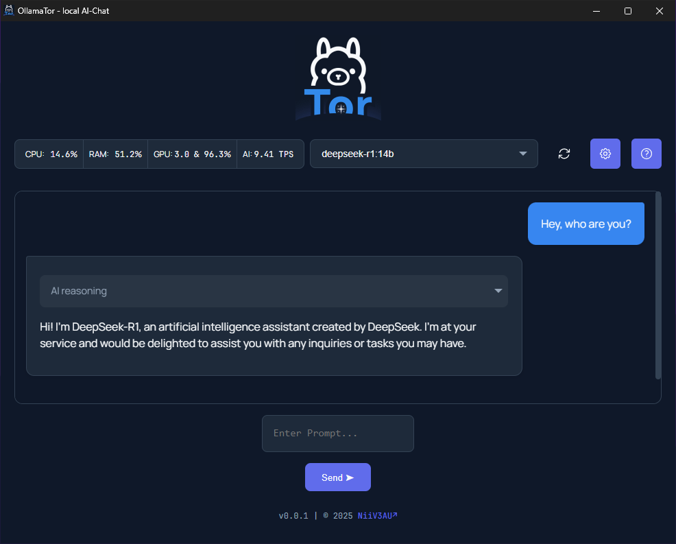

# Welcome to OllamaTor :wave:
OllamaTor is a user-friendly desktop application that brings the power of Ollama's local Large Language Models (LLMs) to your fingertips.
Chat with AI, adjust settings, and monitor system usage. 

# Index
* [Features](#features)
* [Installation](#installation)
* [Getting Started](#getting-started)
* [Requirements](#requirements)
* [Contributing](#contributing)

## Features

*   **Easy Chat:** Select a model and start chatting immediately.
*   **Model Management:** Dropdown selection to choose from your local LLMs collection.
*   **Customizable:** Adjust temperature and chat history length.
*   **Resource Monitoring:** Real-time CPU, RAM, and GPU (load + memory) usage monitor. + AI performance "TPM" (tokens-per-minute)

## Installation

|[Download Ollama.exe](https://github.com/NiiV3AU/OllamaTor/releases/latest)|
|-|

## Getting Started

1.  **Select a Model:** Choose a model from the dropdown.
2.  **Chat:** Type your prompt & click "Send".
4. **Settings:** Use the gear icon to change temperature and history.
5. **Help:** Use the help icon to start the step-by-step tour, download Ollama & get instructions to properly install models

## Requirements

*   Windows 10/11 (other OS not tested)
*   Chrome, Edge or Electron
*   Ollama
*   Downloaded Ollama models
*   Python (for source code execution only; not needed for the compiled `.exe`):
    *   `eel`
    *   `requests`
    *   `psutil`
    *   `GPUtil`

## Contributing

Report bugs or suggest features via GitHub Issues. Pull requests welcome!
