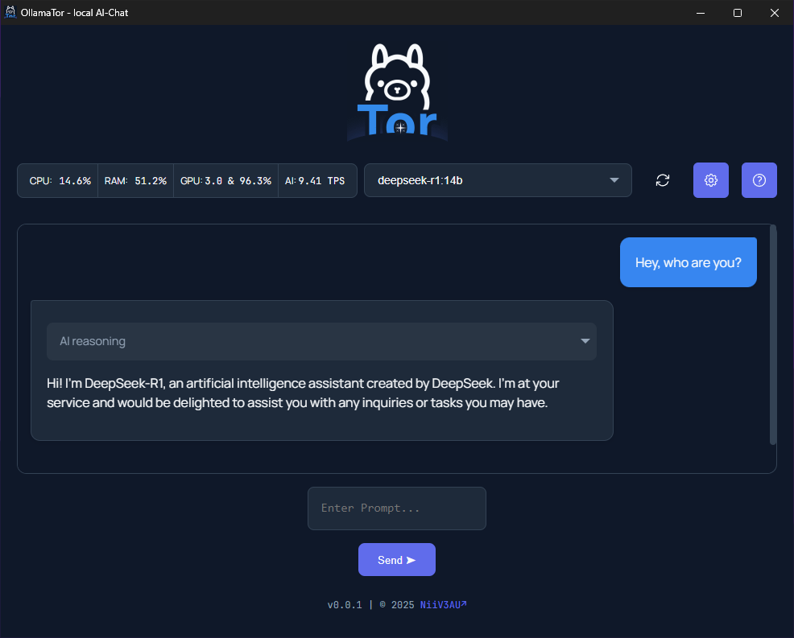

# OllamaTor (Archived) :wave:

> [!IMPORTANT]
> **This repository has been archived and is now read-only.**
> Active development has ceased. The code is preserved for historical and educational reference.
>
> For local AI chat, desktop GUIs, and agent workflows, please consider these actively maintained alternatives:
>
> - **[LM Studio](https://lmstudio.ai/)** & **[Bionic](https://lmstudio.ai/)** - Desktop GUI with model discovery, GPU offloading, and agentic workflows.
> - **[Jan](https://jan.ai/)** - Open-source, local-first ChatGPT alternative (runs offline or connects to an Ollama server).
> - **[Ollama](https://ollama.com/)** - Official desktop app, CLI, and API backend for local LLMs.
> - **[llama.cpp](https://llama.app/)** - Foundational C/C++ inference runtime.
>
> 🌐 Website archive: [ollamator.pages.dev](https://ollamator.pages.dev/)

OllamaTor was an open-source desktop application that brought the power of Ollama's local Large Language Models (LLMs) to Windows using a lightweight Python Eel interface.

## Why was OllamaTor archived?

1. **Architecture & WebSockets**: Built on Python Eel, orchestrating Chrome or Edge in application mode via WebSockets. While practical for rapid prototyping, it introduces external browser runtime dependencies compared to modern native desktop solutions.
2. **Security & Sanitization**: Incoming token streams were parsed with `marked.js` and rendered directly into `innerHTML` without DOM sanitization (e.g. DOMPurify). Model completions or prompt injections containing unescaped HTML, `<style>` tags, or scripts could manipulate or break the application UI.
3. **Ecosystem Evolution**: The local AI ecosystem has matured substantially. Ollama now provides its own official desktop application, alongside polished solutions like Jan and LM Studio/Bionic (closed source).

## Historical Features

- **User-Friendly:** Simple setup with an intuitive chat interface.
- **Customizable:** Adjust temperature, system instructions, and chat context history across local models.
- **Resource Monitoring:** Real-time CPU, RAM, and GPU (load + VRAM) usage monitoring, plus live AI performance in **TPS** (tokens-per-second).
- **Privacy:** All inference and data stay local. No cloud telemetry, no tracking, no accounts.
- **Offline Availability:** Functions completely offline once models are downloaded.

## Getting Started (Historical Reference)

1. **Select a Model:** Choose an installed Ollama model from the dropdown.
2. **Chat:** Type your prompt and click "Send".
3. **Settings:** Use the gear icon to adjust model temperature and history length.
4. **Help:** Use the help icon to start the interactive tour and view setup guidance.

## Requirements

- Windows 10/11 (64-bit)
- [Chrome](https://www.google.com/chrome/) or [Edge](https://www.microsoft.com/edge/) (used by Eel in `--app` mode)
- [Ollama](https://ollama.com/) installed and running locally
- Downloaded [Ollama models](https://ollama.com/search)
- Python (Optional, only needed when running from source rather than the compiled `.exe`):
  - `eel`
  - `requests`
  - `psutil`
  - `nvidia-ml-py`

## Legacy Downloads

Legacy compiled releases remain available for archival reference:

| [Download Legacy OllamaTor.exe (v0.0.3)](https://github.com/NiiV3AU/OllamaTor/releases/latest) |
| ---------------------------------------------------------------------------------------------- |

> [!NOTE]
> Historical releases are provided as-is without future security patches or feature updates.
